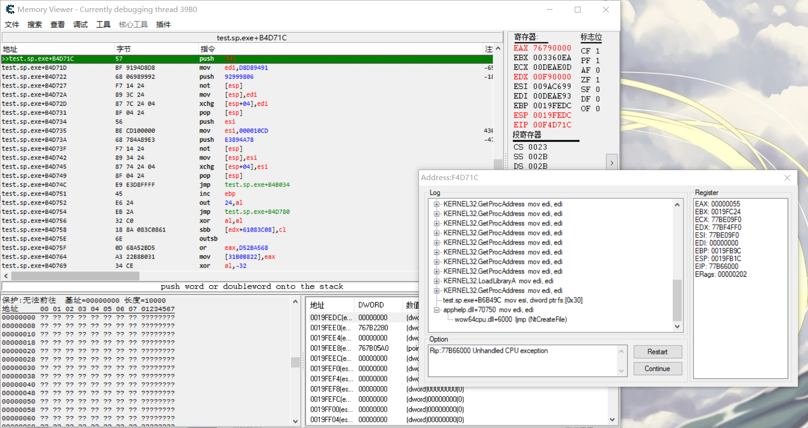

## :page_with_curl: Support Version
Cheat Engine 6.5~Higher
## :mag: Preview

## :snowflake: Reference & Thanks
* Cheat Engine[[Debugger with plugin](https://github.com/cheat-engine/cheat-engine)]
* Unicorn[[CPU emulator framework](https://github.com/unicorn-engine/unicorn)]
* Capstone[[Disassembly framework](https://github.com/aquynh/capstone)]
## :lock: License

[MIT License](/LICENSE)